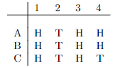
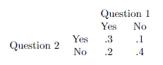

```{r setup, include=FALSE}
knitr::opts_chunk$set(echo = TRUE)
```

# **Problem 1**
Three players, A,B, and C, each flip their coins until one person has a
different result from the others. The person having the different result
wins. For instance, if the players flip as in the table below, then all flip
heads in the first round (column) so they flip again. Then all flips tails
in the 2nd round so they flip again. All flips heads in the third round, so
they flip again. Finally, C has a different result than the others in the 4th
round, so C would win.



## a.)
Using R, simulate this experiment 10000 times and give the resulting
estimate of P(A wins).

```{r}
trials = 10000

wins_of_A = rep(0,trials)

for (i in 1:trials) {
  while(1) {
    A = runif(1) < .5
    B = runif(1) < .5
    C = runif(1) < .5
    if (A != B | B != C) break
  }
  wins_of_A[i] = (A != B & B == C)
}

prob = sum(wins_of_A)/trials

cat("P(A) is:", prob, "\n")
```

## b.)
How many trials are necessary before the 95% confidence interval has a half 
width .02, using the simple $\frac{1}{\sqrt{n}}$ rule? That is, when the 
interval is of the form x ± .02?

\[
\frac{1}{\sqrt{n}} = .02
\]
\[
n = 2500
\]

## c.)
The true value, P(A wins), may or may not be in your confidence
interval. What can be said about the reliability of the confidence
interval containing P(A wins)?

```
A 95% confidence interval means that there is a 95% probability that the P(A) 
is in the given interval. With more data collected (more trials) the interval 
will continue to shrink.
```

## d.)
What is the true probability of P(A wins), and why?

```
Because this is a fair coin (symmetry), no player is favored over the others.
The true probability for P(A) is 1/3.
```

# **Problem2**
A and B alternate drawing cards from a shuffled pack, replacing each card
when done to a random location. A goes first. Play continues until a red
card is drawn.

## a.)
Simulate this experiment to compute P(A draws first red card) to 2
decimal places (±.005) using the $\frac{1}{\sqrt{n}}$ rule.

\[
1/sqrt(n) = 0.005
\]

\[
n = 40000
\]

```{r}
trials = 40000

wins_of_A = rep(0,trials)

for (i in 1:trials) {
  while(1) {
    A = runif(1) < .5
    B = runif(1) < .5
    if (A | B) break
  }
  wins_of_A = A
}

prob = sum(wins_of_A)/trials

cat("The 95% Confidence Interval of P(A) is ", prob, " +/- ", .005, "\n")
```

## b.)
What is the true probability that A draws the first red card and why?

```
The possiblities in this experiment are:

Both get red
A gets red and B gets black
A gets black and B gets red
Both get black

On a winning round they both can't get black because the first to get red wins so
that is elimated from the possibilies leaving three possible options of outcomes.
All the outcomes are as equally likely so 1/3. In the first option red is going 
first so they win that one. This leads to P(A) = 2/3.
```

# **Problem 3**
Two cards are drawn from a shuffled deck.

## a.)
Give the sample space for the experiment, Ω, and calculate |Ω| —
the number of elements in Ω.

```
The sample space is Ω = {(c1, c2,) : c1 != c2, c1, c2 ∈ the deck of cards}.
52 * 51 = 2652 
```

## b.)
How many elements of Ω have both cards having the same rank? (i.e.
both aces or both kings etc.)

```
13 * 4 * 3 = 156 pairs of the same rank in Ω
```

## c.)
What is the probability of drawing a pair? (both same rank)

```
156/2652 = .0588
```

# **Problem 4**
Suppose we are interested in P(A) for some event A. While the $\frac{1}{\sqrt{n}}$ rule is simple, a better 95% confidence interval is given by:

\[
\hat{p}±1.96*\sqrt{\frac{\hat{p}(1-\hat{p})}{n}}
\]

Where $\hat{p}$ is still the proportion of times A occurs in our sample. This
confidence is smaller, which is better, but still the true probability about 95%
of the time.\
Suppose our event of interest has P(A) = 1/10.

## a.)
Simulate 300 trials of the experiment and print out the resulting
confidence interval using the formula above — you only need to know
P(A) to do this.

```{r}
trials = 300

phat = sum(runif(trials)<.1)/trials

margin = 1.96*sqrt(phat*(1-phat)/trials)

cat(phat, "+/-", margin, "\n")
```

## b.)
In your simulation above, for each trial, 1,...,300, plot the upper
and lower endpoints of the confidence interval. That is, if n is the
number of trials done so far, and $u_{n}$ and $l_{n}$ are the upper and lower
limits of the confidence interval based on n trials, plot the points
(x, y) = (n, $u_{n}$) and (x, y) = (n, $l_{n}$) for n = 1, ..., 300.

```{r}
N = 300

l = rep(0,N)

u = rep(0,N)

trial = (runif(N))

for (n in 1:N) {
  phat = sum(trial[1:n]/n)
  margin = 1.96*sqrt(phat*(1-phat)/n)
  l[n] = phat - margin
  u[n] = phat + margin
}

plot(1:N, u, pch = '*')
points(1:N, l, pch = '+')
```

## c.)
Repeat the experiment from part a) 1000 times and compute the fraction of the time the confidence interval contains the true probability, 1/10. This should happen about 95% of the time.

```{r}
n = 300
p = .1
N = 1000

contains = rep(0,N)

for (i in 1:N) {
  phat = sum(runif(n) < p)/n
  margin = 1.96*sqrt(phat*(1-phat)/n)
  contains[i] = (p > (phat - margin)) & (p < (phat + margin))
}

cat("The contained fraction is: ", sum(contains)/N)
```

# **Problem 5**
A bag contains n distinct (all different) numbers: {$x_{1}$, $x_{2}$, ..., $x_{n}$}. Person A draws a number at random, while person B draws a number from the remaining choices. What is the exact probability that A’s number is greater than B’s number? Explain your reasoning in detail.

```
The true probability is 1/2. If we have an (x,y) pair where x = A and y = B,
we can find a pair where x < y and switch it to find a pair where x > y. This
means that they are symmetric therefore the probability is 1/2.
```

# **Problem 6**
Suppose we want to simulate an experiment that can take outcomes 1, ..., n
with probabilities $p_{1}$, ..., $p_{n}$. To be specific, suppose the R-vector

\[
p = c(.1, .2, .3, .35, .02, .03)
\]

gives the desired probabilities. Write R code that produces a number
from 1 to 6 with the given probabilities, without using if statements. I
recommend using the R command cumsum to do this, though there many
possible approaches. Try to do this with a single line of R code. You
cannot use the sample function for this problem.

```{r}
sum(runif(1) > cumsum(p)) + 1
```

# **Problem 7**
The table below gives the probabilities of a randomly sampled individual’s
answers to two questions

<center>

</center>

## a.)
What is the probability of answering both questions negatively?

\[
.4
\]

## b.)
What is the probability of answering at least one question positively?

\[
.3 + .1 + .2 = 6
\]

## c.)
What is the probability of answering question 1 positively?

\[
.3 + .2 = .5
\]

## d.)
Let A be the event that question 1 is answered positively and B
be the event that question 2 is answer positively. Are these events
mutually exclusive?

```
It is possible for both events to happen at the same time so, they are not
mutually exclusive.
```
