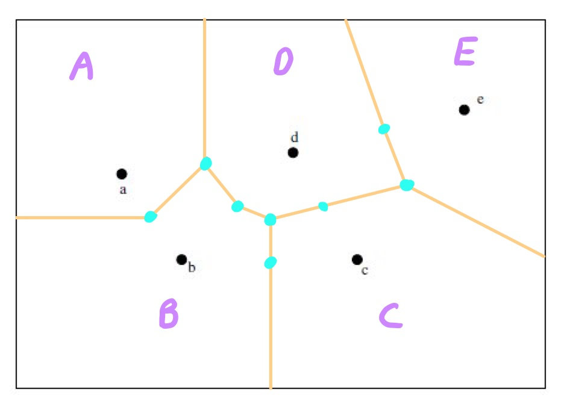
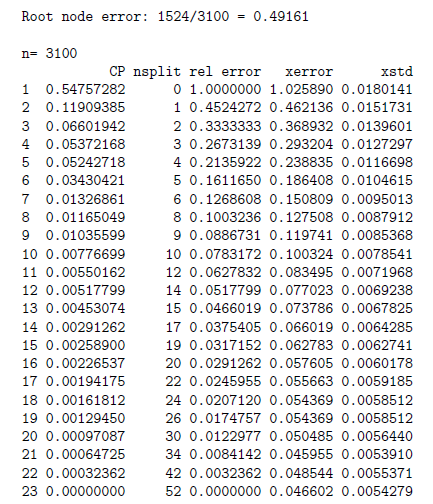

```{r setup, include=FALSE}
knitr::opts_chunk$set(echo = TRUE)
```

### **Question 1**
Here we want to create a 5-NN classifier of the iris data. Following the discussion in class, for each instance in our data set we will find the 5 closest instances (other than the instance itself). It may help to know about the order function in R: If x is vector of numbers, order(x) gives the order of elements. So if index=order(x) then index[1] is the the index of the smallest element, index[2] is the index of the 2nd smallest, etc. Said another way x[index[1]] is the smallest value of x, x[index[2]] is the 2nd smallest, etc. Use this information to create a 5-NN classifier for the iris data. That is, your classifier should loop through each row of the distance matrix and tally the class labels of the 5 closest instances (other than the instance itself). You would classify the instance according to the most prevalent class within the 5 neighbors, breaking ties arbitrarily.


#### a.)
Construct the 5-NN classifier on the iris data by creating a vector, classhat, which is the result of the classifier applied to each instance.


```{r}
data(iris)
dist_matrix <- as.matrix(dist(iris[,1:4]))
classhat <- vector("character", length=nrow(iris))
for (i in 1:nrow(dist_matrix)) {
  ordered_indices <- order(dist_matrix[i,])
  nearest_neighbors <- ordered_indices[2:6]
  neighbor_classes <- iris$Species[nearest_neighbors]
  classhat[i] <- names(sort(table(neighbor_classes), decreasing=TRUE))[1]

}
classhat
```

#### b.)
Estimate the error rate of your classifier.

```{r}
error_rate <- sum(classhat != iris$Species) / length(iris$Species)
print(error_rate)
```

#### c.)
Explain why you do or don't believe your error rate is an accurate estimate of the generalization error rate.

```
The error rate found above is based on the training set. This is not an accurate
depiction of what the error rate will be for the error rate on data outside of the 
training set(generalization error rate).
```

### **Question 2**
Print out the figure below and construct and label the 5 regions, A,B,C,D,E, where A is the region that will be classified as a is classified; B is the region that will be classified at b is classified, etc.




### **Question 3**
Consider the table for a 2-class tree classifier with classes {+,-} below giving the number of +'s and -'s reaching each node.


The nodes are numbered so that 1 is the root, while the children of node k are 2k and 2k + 1. The "terminal" column says if a node is terminal or not.

#### a.)
Construct the tree as a graph (the usual depiction of a tree) labeling the nodes with numbers and giving the classification each node and the number of errors it would produce if it were a terminal node.


#### b.)
Compute R(T) where T is the tree given in the example and R(T) is our probability of error for the tree when tested on the training set.

\[
R(T) = (7+2 + 3 + 5 + 6)/100 = 0.23
\]

#### c.)
Explain why you do or do not believe this is an accurate representation of the tree's performance on new data.

```
The error rate calculated may not effectively reflect the tree's performance on unseen
data, as it relies solely on the training set and might not consider overfitting or the
variability present in new data. To accurately assess performance, validation on an
independent test set is necessary.
```


#### d.)
Compute the optimal penalized risk, $R_{α}^{*}$ for each node of T where α = .03. Give the corresponding optimal tree $T_{α}$.

```
# Node1: min(0.40, 0.03 + 0.15 + 0.14) = 0.32 split
# Node2: min(0.22, 0.03 + 0.05 + 0.07) = 0.15 split
# Node3: min(0.18, 0.05 + 0.03 + 0.06) = 0.14 split
# Node4: min(0.05, 0.03 + 0 + 0.03) = 0.05 prune
# Node9: min(0.03, 0.03 + 0 + 0.03) = 0.03 prune
```


#### e.)
How much do you need to increase α above the initial value of .03 before a different $T_{α}$ appears? Same question for decreasing α.

```
When increasing alpha to 0.09, R(node3) becomes 0.18. Consequently, the adjusted 
Tα becomes min(0.40, 0.18 + 0.21 + 0.09) = 0.40.
Decreasing alpha to 0.02 results in R(node3) being min(0.18, 0.02 + 0.05 + 0.06) 
= 0.13. Similarly, R(node2) becomes min(0.22, 0.02 + 0.05 + 0.07) = 0.14.
Therefore, the modified Tα becomes min(0.40, 0.14 + 0.13 + 0.02) = 0.29.
```

### **Question 4**
The following code shows two things. First we show how to create a matrix from the file "tree_data.dat," available from Canvas, which stores the data above. In the resulting matrix, the columns contain the number of +'s, the number of -'s arriving at each node, and the Boolean variable describing the node as terminal or not. The rows 10 through 17 are all zeros and are unused because in the table above there are no nodes numbered 10-17. This way X[i,] gives the data associated with tree node i.
\
The factorial function, shown below, gives an example of a simple recursive function in R, which you would by, e.g. factorial(5).

```{r}
X = matrix(scan("tree_data.dat"),byrow=T,ncol = 3)

factorial <- function(i) {
  if (i == 1) { return(1); }
  else return(i*factorial(i-1))
}
```

#### a.)
Write a recursive function in R that takes as input the number of a node and returns the optimal risk associated with that node, with a split penalty of α = .03. That is, computed the the penalized error rate of the optimal pruning of the initial tree. When you run your function with input 1 (the root node) it should return the optimal risk for the entire tree.

```{r}
optimal_r = function(node, alpha = 0.03) {
  if (node > nrow(X) || sum(X[node, 1:2]) == 0) {
    return(0)
  }
  if (X[node, 3] == 1) {
    return(min(X[node, 1], X[node, 2]) / sum(X[node, 1:2]))
  } 
  else {
    error = min(X[node, 1], X[node, 2]) / sum(X[node, 1:2])
    lc = node * 2
    rc = node * 2 + 1
    lr = if (lc <= nrow(X)) optimal_r(lc, alpha)
    rr = if (rc <= nrow(X)) optimal_r(rc, alpha)
    # Calculate and return the total penalized risk
    subtree_r <- lr + rr
    return(min(error + alpha, subtree_r))
  }
}

print(optimal_r(1))
```


#### b.)
Let $T_{α=.03}$ denote the associated optimal tree, as computed in the previous problem. Construct this tree, drawing it on paper, explicitly giving the classifications associated with each terminal tree node.


#### c.)
Consider both the tree consisting of only the root node, and the original un-pruned tree. Show that each of these trees has greater penalized error rate than the tree you constructed in the previous part.

```
Initial tree score: 0.40
Tree score with only the root node: 0.40 + 0.03 = 0.43
Score of pruned tree: 0.32 as displayed above
```

### **Question 5**
Consider the following table of cross validation on tree induction for a two-class classification problem, as discussed in class:



#### a.)
In the "rel error" column we get a value of 0 for the 23rd row. Explain what this number means.

 ```
A "rel error" value of 0 in the 23rd row indicates that after the 22nd split,
the error at that particular node is reduced to zero relative to the error at
the root node. This suggests that the model has perfectly fit the data up to
that point. Since the xerror is not significantly higher than zero our model
is probably not overfitting.
 ```

#### b.)
In terms of error rate, how well do you think the tree associated with line 23 will perform on different data from the sample population.

```
Since the xerror is significantly low (0.46602) the model shoud perform well on 
different data from the sample population.
```

#### c.)
Consider the tree that makes no splits -- i.e. the one that simply classifies according to the most likely class. How well will this tree classify new data from the same population.

```
It would be a simple model that may perform well in some cases, but if new data
is introduced it will most likely fail to generalize with different class
distributions.
```

#### d.)
Judging from the table, what appears to be your best choice of complexity parameter α? In what sense is your α value best?

```
According to the one-standard-error rule, the best choice of complexity
parameter (alpha) would likely be the CP value associated with the 20st split
which is alpha = 0.00097087. This is derrived by taking the minimum xerror + xstd
which gives you 0.051346 and find the simplest tree closest to that xerror value.
```

### **Question 6**
As a result of a recent exam, an instructor of a class believes that 80% of the students do yet not understand a topic sufficiently well. The instructor wishes to implement a Naive Bayes classifier to estimate each student's probability of understanding. Students are asked a sequence of 7 true or false questions. The instructor assumes that the responses to these questions are conditionally independent given the student's state of knowledge -- understands or does not understand. Of course, understanding is not really a binary attribute in real life as there are degrees of understanding and various aspects to understanding, though we regard it as binary here.
\
The following code fragment creates a 2x7 matrix, x, where x[i; j] is the probability that a student will answer the jth question correctly when her state of knowledge is i. Here i = 1 corresponds to "not understanding" and i = 2 corresponds to understanding. For ease of computation we compute the 2x7x2 array, z, where z[i; j; k] gives the probability that a student will give answer k (k=1 means wrong and k=2 means right) to question j, given her state of knowledge is i.

```{r}
x = matrix(c(.7, .6, .5, .5, .5, .5, .7, .8, .7, .6, .7, .9, .8, .9 ),byrow=T,nrow=2)
z = array(0,c(2,7,2))
```

#### a.)
Write R code to fill in the matrix z to be as described in the problem.

```{r}
for (i in 1:2) {
  for (j in 1:7) {
    for (k in 1:2) {
      z[i, j, k] <- ifelse(k == 1, 1 - x[i, j], x[i, j])
    }
  }
}
print("1 = wrong and 2 = correct")
z
```

#### b.)
Using your z matrix create an R function that receives a vector of 7 test answers which are either wrong or right. For instance, if the answers are c(0,0,0,0,1,1,1), that would mean the student answered only the last three questions correctly. The function should return the probability that the student has understood the subject, using a Naive Bayes classifier.


```{r}
naiveBayesClassifier = function(answers) {
  prior_nu <- 0.8
  prior_u <- 0.2
  
  prob_nu = prod(sapply(1:length(answers), function(i) z[1, i, answers[i] + 1]))
  prob_u = prod(sapply(1:length(answers), function(i) z[2, i, answers[i] + 1]))
  
  num_u = prob_u * prior_u
  denom = (prob_nu * prior_nu) + num_u

  total_prob_u = num_u / denom
  
  return(total_prob_u)
}

answers <- c(0, 0, 0, 0, 1, 1, 1)
print(naiveBayesClassifier(answers))
```