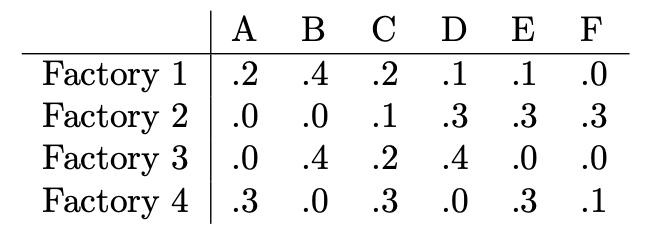

```{r setup, include=FALSE}
knitr::opts_chunk$set(echo = TRUE)
```

### **Question 1**

Consider the Vocab.csv data on Canvas (in the data folder), containing the number of years of education and the performance on a vocabulary test for a number of individuals. For this problem we want to perform simple linear regression by modeling the relationship between the response (the test score) and the predictor (the education level). As with the simple linear regression done in class, case we want to model

\[
y_{i} ≈ ax_{i} + b
\]

However, we want to do this according to the generic method for regression presented in class in which we solve the normal equations, $X^t$$X_α$ = $X^t_y$ using an appropriate choice of X matrix.


#### a.)
In R, read in the data and create the X matrix that would be appropriate for estimating a and b.

```{r}
# Load the data
data <- read.csv("Vocab.csv")

# Create the design matrix X
X <- cbind(1, data$education)

# There are too many entries for me to reasonably print this out.
```

#### b.)
Solve the normal equations with your choice of X and report the values you get for a and b.

```{r}
n = length(data)
x = data$education
y= data$vocabulary

xbar = sum(x)/n;
ybar = sum(y)/n;
xybar = sum(x*y)/n
xsqbar = sum(x*x)/n

b = (ybar*xsqbar-xbar*xybar)/ (xsqbar - xbar*xbar)
a = (ybar - b)/xbar
cat("A is ",a)
cat("\n B is",b)
```

#### c.)
Does it appear that people with more education tend to have larger vocabularies?

```
People with more education seem to have larger vocabularies.
```

#### d.)
It is usually hard to make quantitative statements about the value of a year of education, however, you can do so here in the context of this particular vocabulary test. Make such a quantitative statement here.

```
For each additional year of education, the expected increase in test score is: 0.460608.
```


### **Question 2**
Suppose you begin at the point (x, y, z) = (1, 2, 3) in 3-space and would like to arrive at the point (x, y, z) = (3, 2, 1). In moving through 3-space you can travel as far as you want in the three directions, $d_1$ , $d_2$ , $d_3$ given below, including in the “opposite” directions.

\[
d_1 = \begin{pmatrix}1 \\ -1 \\ 2\end{pmatrix}, d_2 = \begin{pmatrix}5 \\ 4 \\ 0\end{pmatrix}, d_3 = \begin{pmatrix}1 \\ 1 \\ 1\end{pmatrix}
\]

#### a.)
How far should you travel in each of the 3 directions?

```{r}
X =matrix(c(1,-1,2,5,4,0,1,1,1),byrow=F, nrow=3)
print(X)
y = c(2,0,-2)
answer = solve(X,y)
d1 = answer[1]
d2 = answer[2]
d3 = answer[3]

# Print the distances
cat("Distance to travel in each direction:","d1=", d1,",","d2=", d2,",","d3=", d3)
```

#### b.)
Suppose you can only use the first two directions, d1 and d2. How far should you travel in each of these directions so that you get as close to your goal as possible?

```{r}
dir1 <- c(1, -1, 2)
dir2 <- c(5, 4, 0)
end <- c(2, 0, -2)  # This is the goal vector (3,2,1) minus the starting point (1,2,3)

# Combine d1 and d2 into a matrix
mat <- cbind(dir1, dir2)

# Solve the least squares problem without an intercept
fit <- lm(end ~ mat - 1)

# Display the coefficients, which represent how far to travel in each direction d1 and d2
temp = coefficients(fit)

d1 = temp[1]
d2 = temp[2]

cat("Distance to travel in each direction:","d1:", d1,",","d2:", d2)
```


### **Question 3**
The following table shows the proportions of 6 colors of M&Ms, A, ..., F, produced by 4 different factories. You can buy any number of pounds of M&Ms from any factory, not necessarily integral numbers. However, you can also sell M&Ms back to the factories at the exact same “exchange rate.”




#### a.)
You would like to get 20 pounds of M&Ms of each of the 6 different colors. While this may not be possible, find the number of pounds purchased from each factory that comes as close to this goal as possible. Compute the difference between your achieved goals and the desired goal in the sense of “sum of squared error.” (SSE)

```{r}
A <- matrix(c(0.2, 0.4, 0.2, 0.1, 0.1, 0.0,
              0.0, 0.0, 0.1, 0.3, 0.3, 0.3,
              0.0, 0.4, 0.2, 0.4, 0.0, 0.0,
              0.3, 0.0, 0.3, 0.0, 0.3, 0.1), byrow =TRUE, nrow=4)
b <- rep(20, 6)
A = t(A)
ans = solve(t(A) %*% A, t(A) %*% b)
achieved <- A %*% ans
sse <- sum((achieved - b) ^ 2)
print(sse)
```


#### b.)
Consider 1000 different variations on your solution, obtained by adding a small random number to your proposed pounds for each factory. You should get the random numbers by .1*rnorm(4) (since there are 4 factories). Compute the SSE for each of the 1000 variations you produce and report the minimum SSE over all of these variations. Your minimum should be larger than your SSE from your proposed solution.

```{r}
sse_variations <- replicate(1000, {
  temp1 <- answer+0.1
  temp2 <- c(temp1, 0)
  variation <- temp2 * rnorm(4)
  achieved_var <- A %*% variation
  sum((achieved_var - b) ^ 2)
})

min_sse <- min(sse_variations)
print(min_sse)
```

#### c.)
Suppose we don’t care about the quantities we obtain for colors E and F. Find a buying strategy that achieves exactly 20 pounds for each of the colors A,B,C,D.

```{r}
A_red <- A[1:4, ]
b_red <- rep(20, 4)

lbs_red <- solve(t(A_red) %*% A_red, t(A_red) %*% b_red)
print(lbs_red)
```

### **Problem 4**
This problem deals with the ais.csv data (also in the Canvas data folder) describing various measurements taken on a collection of Austrailian athletes. These data can be read in using the

```{r}
dat = read.csv("ais.csv",stringsAsFactors=FALSE, sep=",")
```

command (unlike previous datasets where we have used “read.csv2”). For each athlete, the data contain a number of numeric variables we will consider, though we will ignore the gender and sport variables. We are interested in trying to predict the red blood cell count (rcc) from the other numeric variables.


#### a.)
In R, create the X matrix using variables 3 through 12 as the predictors, while creating the response variable from the 2nd variable, rcc. Solve the normal equations and report the values you get for the regression coefficients.

```{r}
# Extract predictors (variables 3 through 12) and response (rcc)
X <- as.matrix(dat[, 3:12])
y <- dat$rcc

# Solve the normal equations
alpha <- solve(t(X) %*% X) %*% t(X) %*% y

# Report the values for the regression coefficients
cat("Regression Coefficients:", alpha)

```

#### b.)
Compute your predicted values of the rcc level, $\hat{y}$, the errors (e = y − $\hat{y}$ ), and the give the sum of squared errors (SSE), defined by $\sum_{i}{e_i^2}$.

```{r}
# Compute predicted values
y_hat <- X %*% alpha

# Compute errors
errors <- y - y_hat

# Compute SSE
SSE <- sum(errors^2)

# Print SSE
cat("Sum of Squared Errors (SSE):",SSE)
```


#### c.)
In a loop, perform a regression by omitting a single variable from the collection of predictors used above. The first time through the loop you should omit variable 3, the 2nd time through the loop you should include 3 but omit 4, etc. In each case compute your sum of squared errors. Which variable’s omission causes the greatest increase in sse? Which variable appears to be the most important in predicting rcc?

```{r}
# Initialize vector to store SSE for each variable omission
SSE_omi <- numeric(10)

# Perform regression by omitting each variable
for (i in 1:12) {
  # Omit the i-th variable
  X_i <- X[, -i]
  
  # Solve normal equations
  alpha_i <- solve(t(X_i) %*% X_i) %*% t(X_i) %*% y
  
  # Compute predicted values
  y_hat_i <- X_i %*% alpha_i
  
  # Compute SSE
  SSE_omi[i] <- sum((y - y_hat_i)^2)
}

# Find the variable with the greatest increase in SSE
vari_max_incr <- colnames(X)[which.max(SSE_omi)]

# Print the variable with the greatest increase in SSE
cat("Variable with the greatest increase in SSE when omitted:",vari_max_incr)

```


### **Problem 5**
This problem uses the Nottingham beer sales data which you can include into your R program with:

```{r}
data(nottem)
y = nottem
n = length(y)
x = 1:n
```

Here y is a vector containing the monthly beer sales from the Nottingham company for 20 consecutive years (n = 240 months), numbered by the vector x.

#### a.)
Plot the sales data for the various months using both lines and points, as below:

```{r}
plot(x,y,type="b", main = "Monthly Beer Sales", xlab = "Month", ylab = "Sales")  # b is for "both"
```

#### b.)
Construct the X matrix for simple linear regression (yi ≈ axi + b) and solve for a and b. Plot the resulting line on top of the original plot.

```{r}
# Construct the X matrix for simple linear regression
X <- cbind(rep(1, n), x)

# Solve for a and b
alpha <- solve(t(X) %*% X) %*% t(X) %*% y

# Predicted values
y_pred <- X %*% alpha

# Plot the resulting line on top of the original plot
plot(x,y,type="b", main = "Monthly Beer Sales", xlab = "Month", ylab = "Sales")
lines(x, y_pred, col = "red")
```


#### c.)
Of course the linear model has no chance to capture the seasonal pattern of sales. We will model this periodic component by including a sine wave and a cosine wave, both n points long, oscillating with 12 points per period (there are 12 months in a year). Specifically, we use the model:

\[
y_i ≈ a\cos(2πx_i/12) + b\sin(2πx_i/12) + c
\]
Find the values for a,b,c that minimize the sum of squared errors in predicting the {yi}. Plot your fitted model on the same plot as the original data, using a different color for each. Be sure to use both lines and points in your plot.

```{r}
# Model: yi ≈ a * cos(2πxi / 12) + b * sin(2πxi / 12) + c

# Construct the X matrix
X <- cbind(cos(2 * pi * x / 12), sin(2 * pi * x / 12), rep(1, n))

# Solve for a, b, and c
alpha <- solve(t(X) %*% X) %*% t(X) %*% y

# Predicted values
y_pred <- X %*% alpha

# Plot the fitted model on the same plot as the original data
plot(x, y, type = "b", main = "Monthly Beer Sales with Fitted Model", xlab = "Month", ylab = "Sales")
lines(x, y_pred, col = "blue")
```

#### d.)
The company hopes that, in addition to the obvious seasonal pattern, their sales grow over time. Consider the model

\[
y_i ≈ a\cos(2πx_i/12) + b\sin(2πx_i/12) + c + dx_i
\]

that accounts for a possible linear trend in sales. Fit this model to that data and plot the fitted results as you did in the previous part, showing both original data and fitted model. Do the results suggest that the company is experiencing growth in sales? Explain your answer in terms of the estimated regression coefficients.

```{r}
# Fit the model
model <- lm(y ~ cos(2 * pi * x / 12) + sin(2 * pi * x / 12) + x)

# Extract coefficients
coefficients <- coef(model)

# Predicted values
y_pred <- coefficients[1] * cos(2 * pi * x / 12) + coefficients[2] * sin(2 * pi * x / 12) + coefficients[3] + coefficients[4] * x

# Plot the original data and the fitted model
plot(x, y, type = "b", main = "Monthly Beer Sales with Fitted Model (Seasonal Pattern + Linear Trend)", xlab = "Month", ylab = "Sales")
lines(x, y_pred, col = "green")

# Add legend
legend("topleft", legend = c("Original Data", "Fitted Model"), col = c("black", "green"), lty = 1, cex = 0.8)

```

```
When the green line consistently falls below the black points, it suggests that the model consistently underestimates actual sales values. This signals the need for further investigation and possible refinement of the model to better understand and predict sales patterns accurately.
```

### **Problem 6**
Consider the Air Passengers data set that can be imported to R as usual, that is

```{r}
data(AirPassengers)
```

#### a.)
Plot the log of the number of passengers for each month and, from this plot, propose a model for the log data along the lines of regression.

```{r}
pass <- AirPassengers
log_pass = log(pass)
len_y=length(pass)
x = 1:len_y
plot(x, log_pass)
# Plot the log of the passenger numbers
n = len_y
X = cbind(rep(1,n), x, cos(2 * pi * x / 12),  sin(2 * pi * x / 12))

y = log_pass;
a = solve(t(X) %*% X, t(X) %*% y);

yhat = X %*% a;
lines(x, yhat, col=5)
```

#### b.)
Fit your model to the log data and plot your fitted model on this same graph as the log data.

```{r}
# Define the time vector
x <- 1:length(log_pass)

# Fit the model using non-linear least squares
x = cbind(x, cos((2*pi*x)/12), sin((2*pi*x)/12), 1)
ahat = solve(t(x) %*% x,t(x) %*% y)
yhat = x %*% ahat

# Plot the original log data
plot(x, log_pass, type = 'o', col = 'blue', main = "Fitted Model vs. Log Data", ylab = "Log of Passengers", xlab = "Time")
lines(x[,1],yhat,col='red')
# Add the fitted model to the plot

legend("topleft", legend=c("Log Data", "Fitted Model"), col=c("blue", "red"), lty=1, cex=0.8)
```

#### c.)
Plot both the original data and the fitted model in the non-log-transformed domain — that is, in the original form.

```{r}
plot(pass, type = 'o', col = 'blue', main = "Original Data vs. Fitted Model", ylab = "Number of Passengers", xlab = "Time")

# Plot the back-transformed fitted model
lines((fitted(fit)), col = 'red', lwd = 2)

legend("topright", legend=c("Original Data", "Fitted Model"), col=c("blue", "red"), lty=1, cex=0.8)
```


